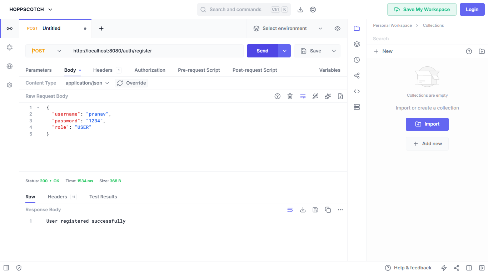
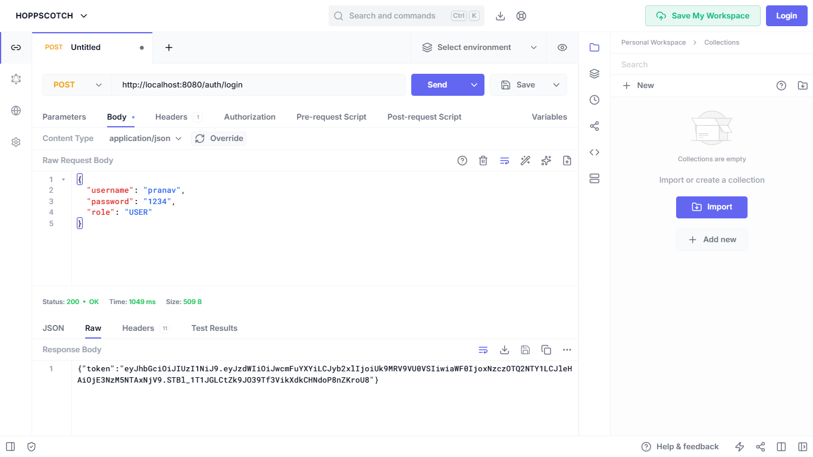
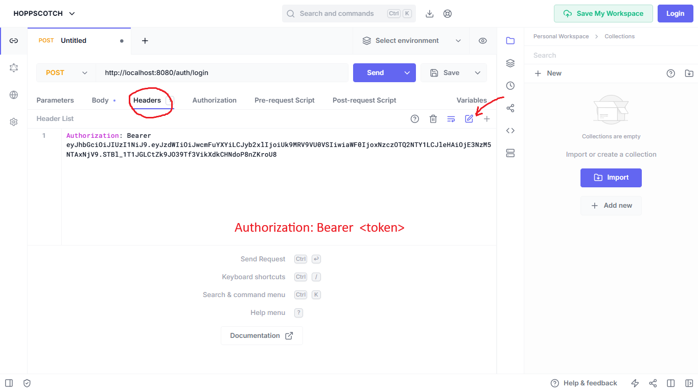
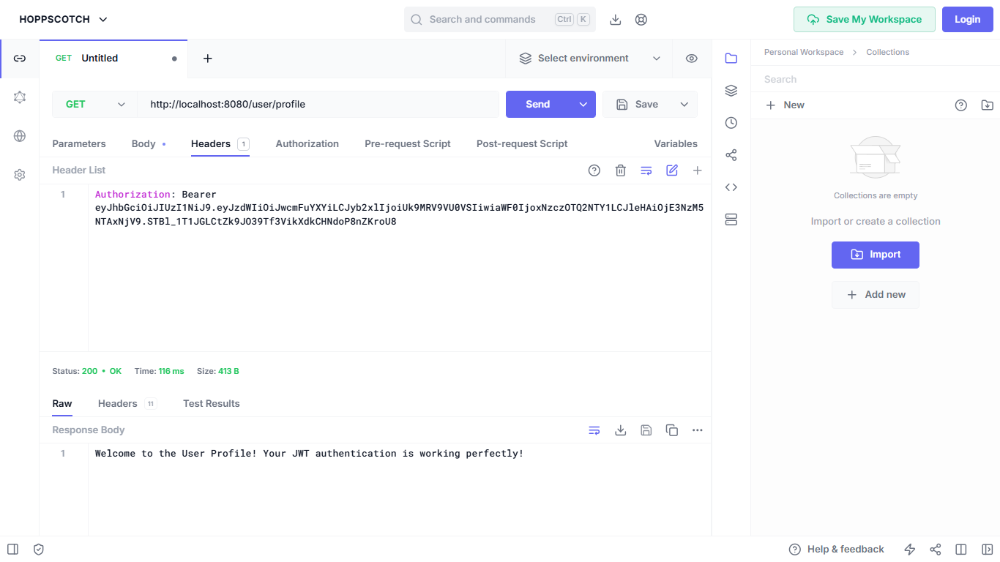
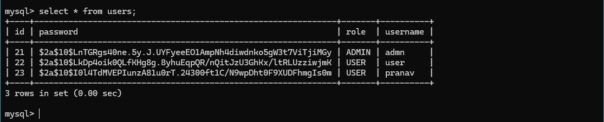

# 🔐 Spring Security JWT Authentication System

A complete end-to-end backend security implementation using **Spring Boot**, **Spring Security**, and **JWT (JSON Web Token)**. This project demonstrates how to build a **secure, stateless authentication system** with **role-based access control**.

---

## 🚀 Features

* 🔑 User Registration & Login
* 🔐 JWT-based Authentication
* 🛡️ Role-based Authorization (USER / ADMIN)
* ⚡ Stateless Security (No Sessions)
* 🔍 Custom JWT Filter
* 🔒 Password Encryption using BCrypt
* 🗄️ MySQL Database Integration
* 📦 Clean Layered Architecture

---

## 🛠️ Tech Stack

* Java
* Spring Boot
* Spring Security
* JWT
* MySQL
* Maven

---

## 📁 Project Structure

```
com.example.security
│
├── config        # Security Configuration  
├── controller    # API Controllers  
├── dto           # Request/Response Models  
├── entity        # Database Entities  
├── repository    # JPA Repositories  
├── service       # Business Logic  
├── security      # JWT + Filters  
```

---

## 🔄 Authentication Flow

```
Client → Login Request
        ↓
AuthenticationManager
        ↓
UserDetailsService
        ↓
Database (MySQL)
        ↓
JWT Token Generated
        ↓
Client Stores Token
        ↓
Client Sends Token in Header
        ↓
JWT Filter Validates Token
        ↓
Access Granted
```

---

## 📌 API Endpoints

### 🔐 Auth APIs

| Method | Endpoint       | Description       |
| ------ | -------------- | ----------------- |
| POST   | /auth/register | Register new user |
| POST   | /auth/login    | Login & get token |

---

### 👤 User APIs

| Method | Endpoint      | Access |
| ------ | ------------- | ------ |
| GET    | /user/profile | USER   |

---

### 👑 Admin APIs

| Method | Endpoint     | Access |
| ------ | ------------ | ------ |
| GET    | /admin/users | ADMIN  |

---

## ⚙️ Setup Instructions

### 1️⃣ Clone Repository

```bash
git clone https://github.com/your-username/project-name.git
cd project-name
```

### 2️⃣ Run Project

```bash
mvn spring-boot:run
```

---

## 🔑 How to Use

### 1️⃣ Register User

**POST** `/auth/register`

```json
{
  "username": "pranav",
  "password": "1234",
  "role": "USER"
}
```

---

### 2️⃣ Login

**POST** `/auth/login`

```json
{
  "username": "pranav",
  "password": "1234"
}
```

➡️ You will get JWT Token

---

### 3️⃣ Access Protected API

Add Header:

```
Authorization: Bearer <your_token>
```

---

## 📸 Screenshots

## 📸 Screenshots

### 🔹 Register API


### 🔹 Login API


### 🔹 JWT Token Response


### 🔹 Protected API


### 🔹 DataBase


---

## 🧠 Key Concepts Covered

* Spring Security Architecture
* SecurityFilterChain
* AuthenticationManager
* UserDetailsService
* Password Encoding
* JWT Token Generation & Validation
* Custom Filter (OncePerRequestFilter)
* Stateless Authentication

---

## 🙌 Author

**Pranav Chavan**
